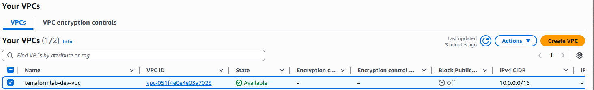
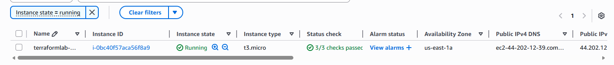
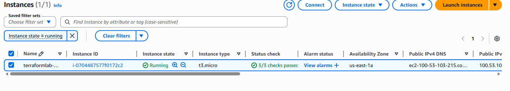
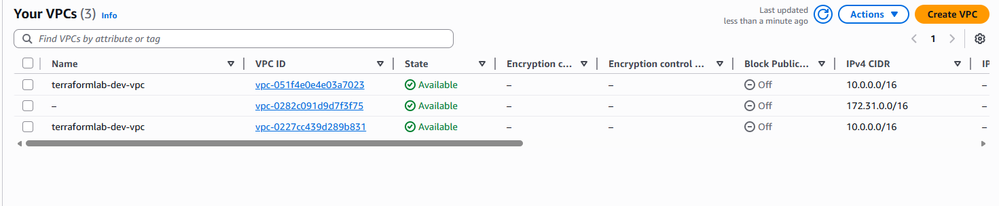

# Terraform AWS EC2 Lab Series

Production-grade Infrastructure as Code project using Terraform to provision
and manage AWS infrastructure. Built as a 5-part series replicating real
DevOps team workflows. Every lab builds on the previous one.

---

## Technologies Used

- Terraform v1.x
- Amazon Web Services (EC2, S3, DynamoDB)
- AWS CLI
- Git and GitHub
- VS Code

---

## Lab Series Progress

| Lab | Topic | Status |
|-----|-------|--------|
| Lab 1 | EC2 with Terraform | Complete |
| Lab 2 | Variables and Outputs | Complete |
| Lab 3 | Remote State with S3 and DynamoDB | Complete |
| Lab 4 | VPC and Security Groups | Complete |
| Lab 5 | Terraform Modules | complete |

---

## Prerequisites

Before starting make sure you have:

- AWS account with IAM user and access keys
- Terraform installed
- AWS CLI installed and configured
- Git installed
- VS Code installed

Open your terminal and configure AWS credentials:

    aws configure

Enter when prompted:

    AWS Access Key ID:     your access key
    AWS Secret Access Key: your secret key
    Default region name:   us-east-1
    Default output format: json

Verify credentials:

    aws sts get-caller-identity

Fix IPv6 connectivity issue on Windows — run once:

    echo 'export GODEBUG=preferIPv4=1' >> ~/.bashrc
    source ~/.bashrc

---

## Lab 1 — EC2 with Terraform

### Goal
Deploy a real AWS EC2 instance using Terraform with no manual
console clicking.

### Step 1 — Create project folder and files

    mkdir terraform-aws-ec2-lab
    cd terraform-aws-ec2-lab
    touch main.tf variables.tf outputs.tf README.md .gitignore

### Step 2 — Edit main.tf

Open main.tf and paste:

    terraform {
      required_providers {
        aws = {
          source  = "hashicorp/aws"
          version = "= 5.31.0"
        }
      }
    }

    provider "aws" {
      region = "us-east-1"
    }

    resource "aws_instance" "web" {
      ami           = "ami-0c02fb55956c7d316"
      instance_type = "t2.micro"

      tags = {
        Name = "TerraformLab"
      }
    }

### Step 3 — Edit variables.tf

Open variables.tf and paste:

    variable "instance_type" {
      default = "t2.micro"
    }

### Step 4 — Edit outputs.tf

Open outputs.tf and paste:

    output "instance_id" {
      value = aws_instance.web.id
    }

### Step 5 — Edit .gitignore

Open .gitignore and paste:

    .terraform/
    *.tfstate
    *.tfstate.backup

### Step 6 — Initialize Terraform

    GODEBUG=preferIPv4=1 terraform init

Expected output:

    Terraform has been successfully initialized!

### Step 7 — Preview changes

    terraform plan

Expected output:

    Plan: 1 to add, 0 to change, 0 to destroy.

### Step 8 — Deploy

    terraform apply

Type yes when prompted.

Expected output:

    Apply complete! Resources: 1 added, 0 changed, 0 destroyed.

### Step 9 — Verify

Go to AWS Console → EC2 → Instances
You should see TerraformLab running with a public IP.

### Step 10 — Destroy

    terraform destroy

Type yes when prompted.

### Step 11 — Push to GitHub

    git init
    git add .
    git commit -m "Lab 1: Deploy EC2 instance with Terraform"
    git branch -M main
    git remote add origin https://github.com/YOUR_USERNAME/terraform-aws-ec2-lab.git
    git push -u origin main

### What you learn
- Terraform provider and resource blocks
- Full workflow: init, plan, apply, destroy
- How Terraform tracks infrastructure in state files

---

## Lab 2 — Variables and Outputs

### Goal
Refactor hardcoded values into input variables so the same codebase
works across dev, staging, and production environments.

### Step 1 — Create new branch

    git checkout -b lab-02-variables

### Step 2 — Edit variables.tf

Open variables.tf, select all and replace with:

    variable "instance_type" {
      description = "EC2 instance type"
      type        = string
      default     = "t2.micro"
    }

    variable "region" {
      description = "AWS region"
      type        = string
      default     = "us-east-1"
    }

    variable "instance_name" {
      description = "Name tag for the EC2 instance"
      type        = string
      default     = "TerraformLab-Dev"
    }

### Step 3 — Edit main.tf

Open main.tf, select all and replace with:

    terraform {
      required_providers {
        aws = {
          source  = "hashicorp/aws"
          version = "= 5.31.0"
        }
      }
    }

    provider "aws" {
      region = var.region
    }

    resource "aws_instance" "web" {
      ami           = "ami-0c02fb55956c7d316"
      instance_type = var.instance_type

      tags = {
        Name = var.instance_name
      }
    }

### Step 4 — Edit outputs.tf

Open outputs.tf, select all and replace with:

    output "instance_id" {
      description = "The ID of the EC2 instance"
      value       = aws_instance.web.id
    }

    output "instance_public_ip" {
      description = "Public IP of the EC2 instance"
      value       = aws_instance.web.public_ip
    }

    output "instance_name" {
      description = "Name tag of the EC2 instance"
      value       = var.instance_name
    }

### Step 5 — Create terraform.tfvars

Create a new file:

    touch terraform.tfvars

Open terraform.tfvars and paste:

    instance_type = "t2.micro"
    region        = "us-east-1"
    instance_name = "TerraformLab-Dev"

### Step 6 — Initialize Terraform

    GODEBUG=preferIPv4=1 terraform init

### Step 7 — Preview changes

    terraform plan

Confirm you see values coming from variables:

    instance_type = "t2.micro"
    Name          = "TerraformLab-Dev"

### Step 8 — Deploy

    terraform apply

Type yes when prompted.

After apply you will see outputs printed automatically:

    Outputs:
    instance_id = "i-xxxxxxxxxxxxxxxxx"

### Step 9 — Destroy

    terraform destroy

Type yes when prompted.

### Step 10 — Push to GitHub

    git add .
    git commit -m "Lab 2: Variables, outputs and reusable code"
    git push origin lab-02-variables

Then open the pull request link and merge into main.

### What you learn
- Input variables with types and descriptions
- terraform.tfvars for environment-specific values
- Output values printed after apply
- How to make one codebase work across multiple environments

---

## Lab 3 — Remote State with S3 and DynamoDB

### Goal
Move Terraform state from your local machine to AWS S3 so multiple
engineers can collaborate without state conflicts.

### The problem this solves

In Labs 1 and 2 state lived on the local machine. In a team
environment two engineers applying at the same time would corrupt
the state file. Lab 3 moves state to S3 so every engineer reads
from the same source of truth. DynamoDB locks the state during
operations so no two applies can run simultaneously.

### Step 1 — Create new branch

    git checkout -b lab-03-remote-state

### Step 2 — Create setup.tf

Create a new file:

    touch setup.tf

Open setup.tf and paste:

    resource "aws_s3_bucket" "terraform_state" {
      bucket = "terraform-state-YOUR_NAME-lab"

      lifecycle {
        prevent_destroy = true
      }

      tags = {
        Name = "Terraform State Bucket"
      }
    }

    resource "aws_s3_bucket_versioning" "state_versioning" {
      bucket = aws_s3_bucket.terraform_state.id

      versioning_configuration {
        status = "Enabled"
      }
    }

    resource "aws_s3_bucket_server_side_encryption_configuration" "state_encryption" {
      bucket = aws_s3_bucket.terraform_state.id

      rule {
        apply_server_side_encryption_by_default {
          sse_algorithm = "AES256"
        }
      }
    }

    resource "aws_dynamodb_table" "terraform_lock" {
      name         = "terraform-state-lock"
      billing_mode = "PAY_PER_REQUEST"
      hash_key     = "LockID"

      attribute {
        name = "LockID"
        type = "S"
      }

      tags = {
        Name = "Terraform State Lock"
      }
    }

Note: Replace YOUR_NAME in the bucket name with your own name.
S3 bucket names must be globally unique across all AWS accounts.

### Step 3 — Create backend.tf

Create a new file:

    touch backend.tf

Open backend.tf and paste:

    terraform {
      backend "s3" {
        bucket         = "terraform-state-YOUR_NAME-lab"
        key            = "lab03/terraform.tfstate"
        region         = "us-east-1"
        dynamodb_table = "terraform-state-lock"
        encrypt        = true
      }
    }

Note: Replace YOUR_NAME with the same name you used in setup.tf.

### Step 4 — Edit outputs.tf

Open outputs.tf and add these two outputs at the bottom:

    output "s3_bucket_name" {
      description = "S3 bucket storing Terraform state"
      value       = aws_s3_bucket.terraform_state.bucket
    }

    output "dynamodb_table_name" {
      description = "DynamoDB table for state locking"
      value       = aws_dynamodb_table.terraform_lock.name
    }

### Step 5 — Initialize Terraform

    GODEBUG=preferIPv4=1 terraform init -plugin-dir=.terraform/providers

### Step 6 — Deploy S3 and DynamoDB

    terraform apply

Type yes when prompted.

After apply verify in AWS Console:
- S3 → Buckets → terraform-state-YOUR_NAME-lab exists
- DynamoDB → Tables → terraform-state-lock exists

### Step 7 — Migrate state to S3

    GODEBUG=preferIPv4=1 terraform init -plugin-dir=.terraform/providers -migrate-state

Type yes when prompted.

Expected output:

    Successfully configured the backend "s3"!

Verify in AWS Console:
S3 → terraform-state-YOUR_NAME-lab → lab03 → terraform.tfstate

Your state file is now in the cloud.

### Step 8 — Destroy EC2 only

The S3 bucket has prevent_destroy set so it cannot be accidentally
deleted. Destroy only the EC2 instance:

    terraform destroy -target=aws_instance.web

Type yes when prompted.

### Step 9 — Push to GitHub

    git add .
    git commit -m "Lab 3: Remote state with S3 and DynamoDB"
    git push origin lab-03-remote-state

Then open the pull request link and merge into main.

### What you learn
- Remote state storage in S3
- State locking with DynamoDB
- Backend configuration and state migration
- prevent_destroy to protect critical resources
- How real DevOps teams share infrastructure state

---

## Project Structure

    terraform-aws-ec2-lab/
    ├── main.tf
    ├── variables.tf
    ├── outputs.tf
    ├── terraform.tfvars
    ├── backend.tf
    ├── setup.tf
    ├── .terraform.lock.hcl
    ├── .gitignore
    ├── screenshots/
    └── README.md

---

## Screenshots
### Lab 1 — EC2 Running

### Lab 2 — Variables and Outputs

### Lab 3 — Remote State

## Key Takeaways

- Never hardcode values in Terraform — use variables
- Always run plan before apply — no surprises in production
- Remote state is mandatory for team environments
- State locking prevents concurrent apply conflicts
- prevent_destroy protects critical resources from accidental deletion
- Branch per lab keeps history clean and reviewable

---

## Lab 4 — VPC and Security Groups

### Goal
Build a complete AWS network from scratch using Terraform modern
best practices — replacing the default VPC with a custom, 
production-ready network.

### What was built
- Custom VPC with CIDR block 10.0.0.0/16
- Internet Gateway connecting VPC to the internet
- Public subnet in us-east-1a with auto-assign public IP
- Route table directing all traffic through the Internet Gateway
- Security Group allowing SSH (port 22) and HTTP (port 80)
- EC2 instance (t3.micro) deployed inside the custom VPC
- Automatic tagging of all resources via default_tags

### Modern best practices introduced

**locals block** — defines reusable values used across all resources:

    locals {
      name_prefix = "${var.project}-${var.environment}"
      common_tags = {
        Environment = var.environment
        Project     = var.project
        ManagedBy   = "terraform"
      }
    }

**default_tags in provider** — automatically tags every resource:

    provider "aws" {
      region = var.region
      default_tags {
        tags = local.common_tags
      }
    }

**Variable validation** — prevents invalid values:

    variable "environment" {
      validation {
        condition     = contains(["dev", "staging", "prod"], var.environment)
        error_message = "Environment must be dev, staging, or prod."
      }
    }

**t3.micro instead of t2.micro** — current generation instance type

### Step 1 — Create new branch

    git checkout -b lab-04-vpc

### Step 2 — Create vpc.tf

Create a new file:

    touch vpc.tf

Open vpc.tf and paste the VPC, Internet Gateway, Subnet,
Route Table and Security Group resources. See vpc.tf in this
branch for the full code.

### Step 3 — Update main.tf

Add locals block and default_tags to provider. Update EC2
resource to reference subnet_id and vpc_security_group_ids
from the new VPC resources.

### Step 4 — Update variables.tf

Replace instance_name variable with environment and project
variables. Add vpc_cidr and public_subnet_cidr variables.
Add validation blocks to environment and instance_type.

### Step 5 — Update terraform.tfvars

    region             = "us-east-1"
    environment        = "dev"
    project            = "terraformlab"
    instance_type      = "t3.micro"
    vpc_cidr           = "10.0.0.0/16"
    public_subnet_cidr = "10.0.1.0/24"

### Step 6 — Initialize and deploy

    GODEBUG=preferIPv4=1 terraform init -plugin-dir=.terraform/providers -migrate-state
    terraform plan
    terraform apply

### Step 7 — Verify in AWS Console

- VPC → Your VPCs → terraformlab-dev-vpc
- VPC → Subnets → terraformlab-dev-public-subnet
- VPC → Security Groups → terraformlab-dev-sg
- EC2 → Instances → terraformlab-dev-ec2 running

### Step 8 — Destroy EC2 only

    terraform destroy -target=aws_instance.web

 ### Screenshots

### What you learn
- Building custom VPC from scratch with Terraform
- Internet Gateway and Route Table configuration
- Security Group firewall rules
- locals block for consistent naming
- default_tags for automatic resource tagging
- Variable validation blocks
- Current generation instance types (t3 vs t2)

- ---
## Lab 5 — Terraform Modules

### Goal
Refactor all infrastructure into reusable modules — the way
production DevOps teams structure Terraform at scale.

### What was built
- modules/vpc — reusable network module (VPC, IGW, subnet, route table, security group)
- modules/ec2 — reusable compute module (EC2 instance)
- Root main.tf calls both modules cleanly
- Any team can reuse these modules with different variables

### What changes from Lab 4

In Lab 4 all resources lived in one flat folder.
In Lab 5 resources are packaged into modules.
The root main.tf only calls modules — no resources directly.

### Step 1 — Create new branch

    git checkout -b lab-05-modules

### Step 2 — Create module folders

    mkdir -p modules/vpc
    mkdir -p modules/ec2

### Step 3 — Create modules/vpc files

    touch modules/vpc/main.tf modules/vpc/variables.tf modules/vpc/outputs.tf

Open modules/vpc/main.tf and add VPC, Internet Gateway, Subnet,
Route Table and Security Group resources using var.name_prefix
for consistent naming.

Open modules/vpc/variables.tf and define vpc_cidr,
public_subnet_cidr, region and name_prefix variables.

Open modules/vpc/outputs.tf and export vpc_id,
public_subnet_id, security_group_id and internet_gateway_id.

### Step 4 — Create modules/ec2 files

    touch modules/ec2/main.tf modules/ec2/variables.tf modules/ec2/outputs.tf

Open modules/ec2/main.tf and define the EC2 instance resource
using var.subnet_id and var.security_group_id passed in from
the VPC module outputs.

Open modules/ec2/variables.tf and define ami, instance_type,
subnet_id, security_group_id and name_prefix variables.

Open modules/ec2/outputs.tf and export instance_id
and instance_public_ip.

### Step 5 — Update root main.tf

Replace all direct resources with module calls:

    module "vpc" {
      source = "./modules/vpc"

      name_prefix        = local.name_prefix
      region             = var.region
      vpc_cidr           = var.vpc_cidr
      public_subnet_cidr = var.public_subnet_cidr
    }

    module "ec2" {
      source = "./modules/ec2"

      name_prefix       = local.name_prefix
      instance_type     = var.instance_type
      subnet_id         = module.vpc.public_subnet_id
      security_group_id = module.vpc.security_group_id
    }

### Step 6 — Update outputs.tf

Reference module outputs instead of direct resources:

    output "instance_id" {
      value = module.ec2.instance_id
    }

    output "vpc_id" {
      value = module.vpc.vpc_id
    }

### Step 7 — Initialize and deploy

    GODEBUG=preferIPv4=1 terraform init -plugin-dir=.terraform/providers -migrate-state
    terraform plan
    terraform apply

After apply you will see every resource prefixed with module:

    module.vpc.aws_vpc.main
    module.vpc.aws_security_group.web
    module.ec2.aws_instance.web

### Step 8 — Destroy EC2 only

    terraform destroy -target=module.ec2.aws_instance.web

### Screenshots

### What you learn
- Structuring Terraform code into reusable modules
- Passing outputs from one module as inputs to another
- How production teams share and version infrastructure modules
- The difference between flat Terraform and modular Terraform

## Author

**Thierno Balde**
[GitHub](https://github.com/Thierno5) | [LinkedIn](https://www.linkedin.com/in/thierno-balde-951332246)

